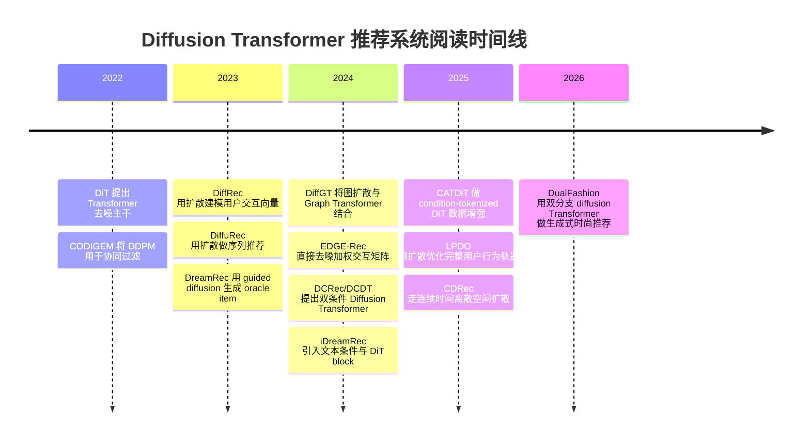

# Diffusion Transformer 推荐系统 Wiki：新手总览

_面向科研新手的阅读入口。更新时间：2026-05-25。_

---

## 这套 Wiki 怎么读

如果你刚开始看这个方向，不要先追公式。推荐顺序是：

1. 先读本页，知道这个领域从哪里来
2. 再读“扩散输入到底是什么”，搞清楚推荐系统和图像生成的输入差别
3. 再读“论文实现速查表”，用一张表看懂每篇文章的输入、处理和输出
4. 最后读“与 RDT 的关系”，把论文思路对应到你 `E:\RDT` 项目的代码

一句话概括这个方向：

> 推荐系统里的 Diffusion Transformer，通常不是从“完全随机图片噪声”生成图片，而是在用户历史、物品文本、图像、协同过滤、图结构等条件下，逐步还原目标物品、交互矩阵、未来行为序列或推荐 slate。

## 领域分层

| 层级 | 代表论文 | 为什么重要 |
| --- | --- | --- |
| 原始 DiT 架构 | Scalable Diffusion Models with Transformers | 它不是推荐论文，但定义了“用 Transformer 做扩散去噪主干”的核心范式。 |
| 扩散推荐开山作 | CODIGEM, DiffRec | 把 DDPM/扩散思想真正放进协同过滤和用户交互生成。 |
| 扩散序列推荐开山作 | DiffuRec, DreamRec | 把“下一个物品”从分类问题改写成目标物品表示的生成问题。 |
| 严格相关的 DiT 推荐 | DiffGT, EDGE-Rec, DCRec/DCDT, iDreamRec, CATDiT, ICDDT | 明确把 Graph Transformer、Diffusion Transformer 或 Transformer 去噪主干用于推荐。 |
| 最新扩展方向 | LPDO, CDRec, ContRec, Prompt-to-Slate, DualFashion, PaDiRec | 分别扩展到轨迹预测、离散扩散、连续 token、slate 生成、多模态生成和参数扩散。 |

## 时间线



## 新手先抓住三个问题

| 问题 | 你应该怎么理解 |
| --- | --- |
| 扩散对象是什么？ | 可能是目标物品 embedding、用户交互向量、用户-物品矩阵、图上的边、未来 item 序列、slate，甚至模型参数。 |
| 条件是什么？ | 用户历史序列、干净历史 embedding、文本描述、图像特征、CF embedding、物品属性、prompt、行为类型等。 |
| 输出是什么？ | 最终一般不是“图片”，而是可用于检索或排序的表示、候选 item、推荐列表、未来轨迹、商品图文解释或模型参数。 |

## 和你 RDT 项目的关系

`E:\RDT` 当前项目最像“连续目标 latent + 多模态条件 + DiT 风格去噪”的路线。它不是纯图像生成，也不是传统 SASRec 分类器，而是：

```text
用户历史 semantic IDs + 文本/图像/CF/流行度条件
        + noisy target latent + timestep
        -> DiT 风格 cross-attention 去噪
        -> denoised target latent
        -> 与 item latent table 检索 Top-K 推荐
```

所以最值得优先读的是 `DCRec/DCDT`、`iDreamRec`、`ContRec`、`CATDiT`、`LPDO`。`DiffGT` 和 `EDGE-Rec` 也重要，但它们更偏图结构和交互矩阵；`DualFashion` 更偏多模态生成式推荐，可作为未来扩展参考。

## 核心来源

| 论文 | 来源 |
| --- | --- |
| DiT | [arXiv 2212.09748](https://arxiv.org/abs/2212.09748), [CVF ICCV 2023 PDF](https://openaccess.thecvf.com/content/ICCV2023/papers/Peebles_Scalable_Diffusion_Models_with_Transformers_ICCV_2023_paper.pdf) |
| CODIGEM | [DBLP](https://dblp.org/rec/conf/ksem/WalkerZZG022), [DOI](https://doi.org/10.1007/978-3-031-10989-8_47) |
| DiffRec | [SIGIR PDF](https://hexiangnan.github.io/papers/sigir23-DiffRec.pdf), [RecBole implementation note](https://recbole.io/docs/v1.2.0/recbole/recbole.model.general_recommender.ldiffrec.html) |
| DiffuRec | [arXiv 2304.00686](https://arxiv.org/abs/2304.00686) |
| DreamRec | [NeurIPS 2023](https://proceedings.neurips.cc/paper_files/paper/2023/hash/4c5e2bcbf21bdf40d75fddad0bd43dc9-Abstract-Conference.html), [arXiv 2310.20453](https://arxiv.org/abs/2310.20453) |
| DiffGT | [arXiv 2404.03326](https://arxiv.org/abs/2404.03326) |
| EDGE-Rec | [arXiv 2409.14689](https://arxiv.org/abs/2409.14689) |
| DCRec/DCDT | [arXiv 2410.21967](https://arxiv.org/abs/2410.21967) |
| iDreamRec | [arXiv 2410.13428](https://arxiv.org/abs/2410.13428) |
| Prompt-to-Slate | [arXiv 2408.06883](https://arxiv.org/abs/2408.06883), [Spotify Research](https://research.atspotify.com/2025/9/prompt-to-slate-diffusion-models-for-prompt-conditioned-slate-generation) |
| CATDiT | [DBLP CIKM 2025](https://dblp.org/rec/conf/cikm/ShiWT25.html) |
| LPDO | [arXiv 2511.00530](https://arxiv.org/abs/2511.00530), [OpenReview PDF](https://openreview.net/pdf?id=x5KUOlYKQr) |
| PaDiRec | [arXiv 2410.10639](https://arxiv.org/abs/2410.10639) |
| ContRec | [arXiv 2504.12007](https://arxiv.org/abs/2504.12007) |
| CDRec | [arXiv 2511.12114](https://arxiv.org/abs/2511.12114) |
| ICDDT | [CIKM 2025 proceedings](https://cikm2025.org/program/proceedings), [DBLP](https://dblp.org/rec/conf/cikm/0004XP025) |
| DualFashion | [arXiv 2605.17357](https://arxiv.org/abs/2605.17357) |
